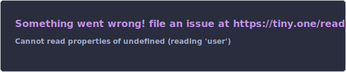

<!-- 14 15 18 24--> 

## Hi there 👋 I'm Sasha! 
I'm a college Junior majoring in Cyber Security :lock: and Physics :page_facing_up: at Ewha Womans University. :mortar_board:

### My Velog... 👀

 
 

## My Algorithm 

 
 
  

## My Github Stats

 

 
 
 👻 

  

 

<!--
**yeeun-uwu/yeeun-uwu** is a ✨ _special_ ✨ repository because its `README.md` (this file) appears on your GitHub profile.

Here are some ideas to get you started:

- 🔭 I’m currently working on ...
- 🌱 I’m currently learning ...
- 👯 I’m looking to collaborate on ...
- 🤔 I’m looking for help with ...
- 💬 Ask me about ...
- 📫 How to reach me: ...
- 😄 Pronouns: ...
- ⚡ Fun fact: ...
-->
